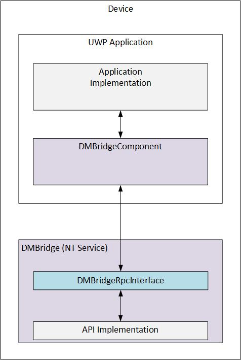

# Windows IoT Core Device Management Bridge

- [Overview](#overview)
    - [Architecture](#architecture)
    - [Getting Started](#getting-started)
        - [DMBridge Executable](#dmbridge-executable)
        - [UWP](#uwp)
        - [Non-UWP](#non-uwp)
- [Other Documentation](#other-documentation)
- [Open-Source Libraries](#open-source-libraries)


## Overview
Device Management (DM) Bridge allows developers to locally configure and monitor
IoT devices. This project exposes APIs for UWP, and non-UWP applications to
easily perform device management. UWP applications can use WinRT APIs, and
non-UWP applications can directly call the Rpc API.


### Architecture

DM Bridge is split into 3 main projects:
- [DMBridgeInterface](src/DMBridgeInterface) defines the Rpc methods that
`DMBridge` will implement, and that `DMBridgeComponent` will call.
- [DMBridge](src/DMBridge/) is an NTService that runs as the `SYSTEM` account
and runs an Rpc server, exposing the APIs defined in `DMBridgeInterface`.
- [DMBridgeComponenet](src/DMBridgeComponent) is a WinRT/C++ Component, and what
can be built as a NuGet package. It provides projections for the Rpc API that
`DMBridge` serves. This allows any UWP application to easily consume the
API *([UWP Example](#uwp))*. Non-UWP applications can directly call the Rpc API
exposed by `DMBridge` rather than going through this UWP-specific project
*([Non-UWP Example](#non-uwp))*.

The below diagram illustrates how each project in this solution is involved for
a UWP application.



### Getting Started
#### DMBridge Executable
If an application calls a DM Bridge API while `DMBridge.exe` is not running, a
`COMException` with the message `the rpc server is unavailable` will be thrown.
Ensure `DMBridge.exe` is either installed and running as a service, or is
running as Administrator using `DMBridge.exe -console` for testing purposes.
For further documentation on how to use `DMBridge.exe` see the
[deploying DMBridge](docs/dm-deployment.md) documentation.

#### UWP
The below is an example of how to use `DMBridgeComponenet` in a UWP C#
application:

```csharp
using DMBridgeComponent;

...

using (var serviceManager = new NTServiceBridge())
{
    int dhcpStatus = serviceManager.Query("dhcp");
}

```
For a more complete usage, including exception handling, see
[the included sample](samples/e2e.csharp.demo), or the
[UWP API documentation](docs/dm-uwp-api.md).

#### Non-UWP
Non-UWP applications can directly call the Rpc methods that `DMBridge` serves.
Below is a simple example of a c program using the `DMBridgeRpcInterface`
project to call a DM Bridge API. The example below should:
- Link with `Rpcrt4.lib`.
- Reference `DMBridgeRpcInterface` or add the project to to the
`Includes Directory` project variable.
- Add `DMBridgeInterface_c.c`, which is generated by the `DMBridgeRpcInterface`
project.

```c
#include "DMBridgeInterface_h.h"
#include <stdio.h>
#include <Rpc.h>

#define RPC_PROTOCOL_SEQUENCE L"ncalrpc"
#define RPC_ENDPOINT L"DmBridgeRpcEndpoint"

int wmain(int argc, wchar_t *argv[])
{
    /* Create the Rpc handle */
    RPC_WSTR stringBinding = nullptr;
    RPC_BINDING_HANDLE rpcHandle = nullptr;

    RpcStringBindingCompose(
                NULL,
                (RPC_WSTR)RPC_PROTOCOL_SEQUENCE,
                NULL,
                (RPC_WSTR)RPC_ENDPOINT,
                NULL,
                &stringBinding);
    RpcBindingFromStringBinding(stringBinding, &rpcHandle);
    RpcStringFree(&stringBinding);

    /* Call a DM Bridge API */
    int dhcpStatus;
    wchar_t* dhcpServiceName = const_cast<wchar_t*>(L"dhcp");
    HRESULT ret = ::QueryServiceRpc(rpcHandle, dhcpServiceName, &dhcpStatus);

    if (ret == S_OK)
    {
        // There were no errors
        printf("DHCP service status: %d", dhcpStatus);
    }

    /* Close the Rpc handle */
    RpcBindingFree(&rpcHandle);

    return 0;
}

/* These must be included for Rpc */
/******************************************************/
/*         MIDL allocate and free                     */
/******************************************************/
void __RPC_FAR * __RPC_USER midl_user_allocate(size_t len)
{
    return(malloc(len));
}

void __RPC_USER midl_user_free(void __RPC_FAR * ptr)
{
    free(ptr);
}
```

For a more complete usage, including exception handling, see
[DMBridgeComponent](src/DMBridgeComponent).


## Other Documentation
- [Adding New API](docs/dm-extending.md)
- [Building (including the NuGet package)](docs/dm-building.md)
- [Configuring](docs/dm-configuration.md)
- [Deploying](docs/dm-deployment.md)
- [UWP APIs](docs/dm-uwp-api.md)

## Open-Source Libraries

DM Bridge uses the following open-source libraries:
- [jsoncpp](https://github.com/open-source-parsers/jsoncpp): A C++ JSON parser
under either the MIT License or Public Domain.
